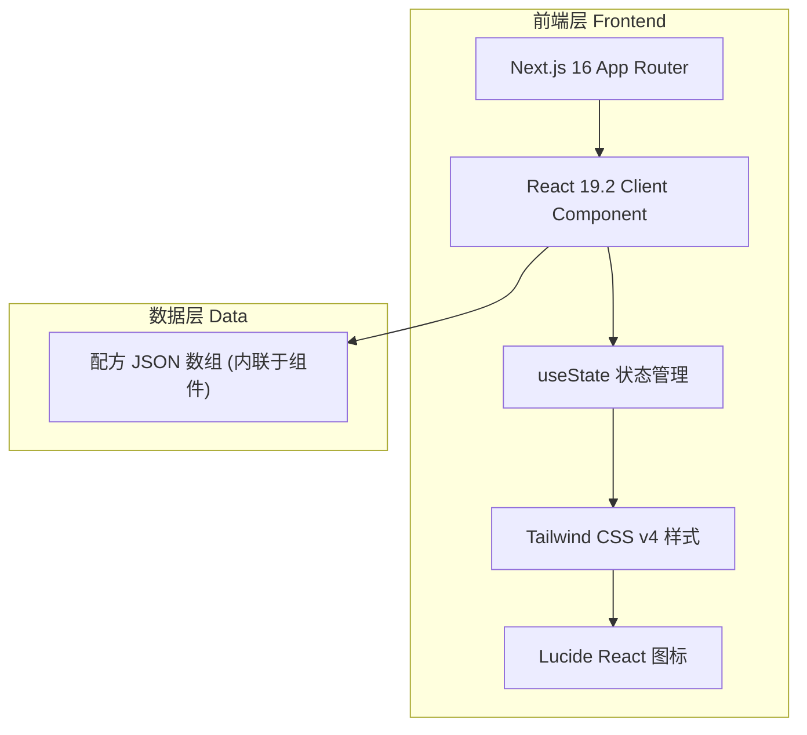

# AI Recipe Shop - 技术架构文档

## 1. 架构设计



纯前端单页应用，无后端服务，所有状态与数据均在客户端管理。

## 2. 技术栈说明

- **前端框架**：Next.js 16.2.9 + React 19.2.4（App Router）
- **样式方案**：Tailwind CSS v4（通过 `@import "tailwindcss"` 引入，PostCSS 插件 `@tailwindcss/postcss`）
- **图标库**：lucide-react 1.20.0
- **字体**：Geist Sans + Geist Mono（next/font/google 内置）
- **状态管理**：React `useState`（筛选状态、解锁状态、Modal 状态、复制提示状态）
- **构建工具**：Turbopack（Next.js 16 默认）
- **后端**：无
- **数据库**：无（配方数据内联于页面组件顶部）

## 3. 路由定义

| 路由 | 用途 |
|------|------|
| `/` | 单页应用主页，包含全部功能 |

## 4. 组件结构

```
app/
├── layout.tsx          # 根布局（字体、metadata）
├── page.tsx            # 主页（"use client" 客户端组件）
└── globals.css         # 全局样式（Tailwind 引入 + 自定义动画）
```

由于是单页应用且需要大量交互（useState、onClick、navigator.clipboard），主页面使用 `"use client"` 指令作为客户端组件。

## 5. 状态设计

| 状态 | 类型 | 用途 |
|------|------|------|
| selectedRole | string | 当前选中的身份 |
| selectedBudget | string | 当前选中的预算倾向 |
| selectedTarget | string | 当前选中的目标产出 |
| unlockedIds | number[] | 已解锁卡片的 id 数组 |
| modalCardId | number \| null | 当前打开 Modal 的卡片 id |
| copiedId | number \| null | 当前显示"复制成功"的卡片 id |

## 6. 筛选逻辑

配方匹配规则：卡片的 `role`、`budget`、`target` 三个字段需与用户选择完全匹配。当无匹配时展示空状态提示。

## 7. 关键交互实现

- **模糊遮罩**：使用 Tailwind `blur-xl` + `backdrop` 实现，解锁后移除类名
- **Modal 弹窗**：固定定位 + 半透明遮罩 + 缩放淡入动画
- **一键复制**：`navigator.clipboard.writeText()`，复制后 2 秒内显示成功提示
- **响应式**：`lg:grid-cols-[320px_1fr]` 实现桌面分栏，移动端单列堆叠
